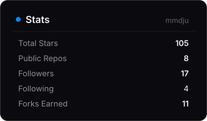

# Hi there, I'm Javad

**Code, automation, and whatever catches my interest.**

Tehran, Iran · Open to work · Ask me about MCP, APIs, Bots

---

### Tech Stack

---

### Featured Projects

<table>
<tr>
<td width="50%">

**Digikala MCP**
 MCP server for Iran's biggest marketplace. 16 tools, read-only, no key needed.
  
 

</td>
<td width="50%">

**Divar MCP**
 MCP server for Iran's largest classifieds. 7 tools: search, compare, price verdict.
  
 

</td>
</tr>
<tr>
<td width="50%">

**OrcaMovies**
 Bilingual Telegram assistant: smart search, ratings, subtitles, alerts.
  
 

</td>
<td width="50%">

**OrcaSave**
 Media downloader bot. Link from 8 platforms in, file back in chat.
  
 

</td>
</tr>
</table>

[orca-mcp](https://github.com/mmdju/orca-mcp) · [fa-text-utils](https://github.com/mmdju/fa-text-utils) · [imdb-top250-api](https://github.com/mmdju/imdb-top250-api) · [letterboxd-top500-api](https://github.com/mmdju/letterboxd-top500-api)

---

### Stats

|  |  |
|---|---|

