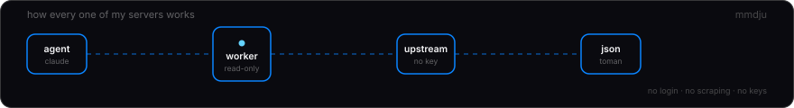
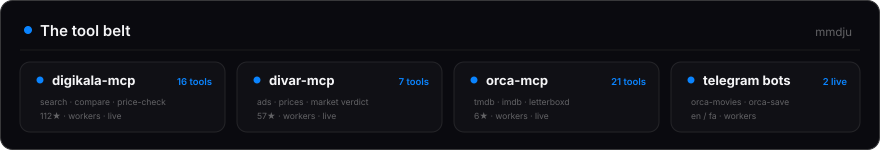
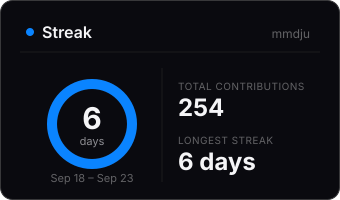

  

---

---

---

### Projects

<table>
<tr>
<td width="50%">

**Digikala MCP**
 MCP server for Iran's biggest marketplace. 16 tools — search, compare, price-check. No API key.
  
 

</td>
<td width="50%">

**Divar MCP**
 Classifieds intelligence for AI agents. 7 tools, Toman prices, live market verdicts. Read-only.
  
 

</td>
</tr>
<tr>
<td width="50%">

**Orca MCP**
 Movie &amp; TV intelligence for agents. 21 tools across TMDB, IMDb, Letterboxd, RT/MC.
  
 

</td>
<td width="50%">

**OrcaMovies / OrcaSave**
 Bilingual Telegram assistant and a media downloader. EN / FA, both on Workers.
  
 

</td>
</tr>
</table>

[fa-text-utils](https://github.com/mmdju/fa-text-utils) · [imdb-top250-api](https://github.com/mmdju/imdb-top250-api) · [letterboxd-top500-api](https://github.com/mmdju/letterboxd-top500-api)

---

---

|  |  |
|---|---|

